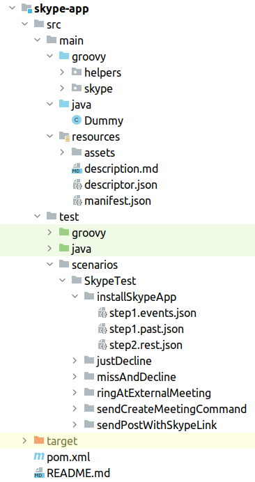
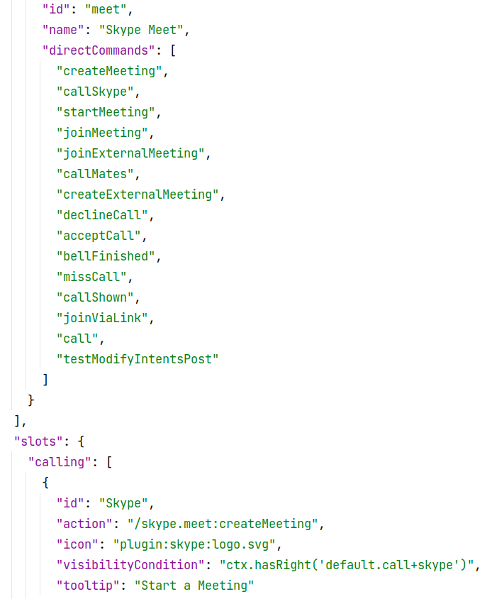
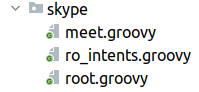
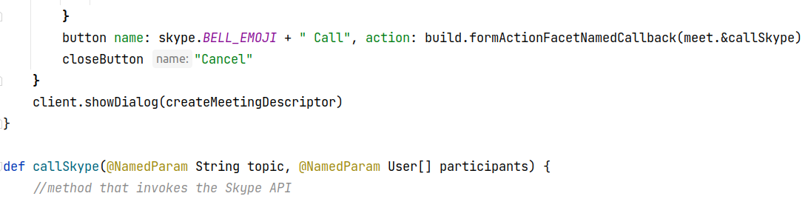
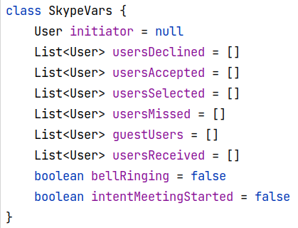
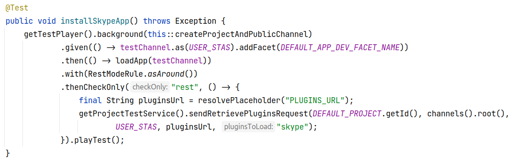
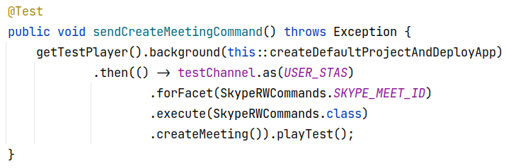

.. meta::
  :description: This document contains all the technical information about Webhook Bot functionality of Leverice.

.. _app-desc-reference-label:

Make application for Leverice
================

Overview
############################################

In this tutorial we will create and deploy application for Leverice. For example we will use Skype app.

Folder structure
############################################

* helpers - have class with static methods which use in different facets (like dto with some command methods) in the same model
* skype - main groovy folder
* Dummy - empty java class which needs for compiling app
* assets - contains svg icons
* description.md - description for the app
* descriptor.json - describe main command
* manifest.json - how app looks in app store

* test - folder with tests in java and groovy

    * scenarios - some scenarios for tests. Name of the folders inside SkypeTest create by the name of methods inside skype folder

        * .events.json - checks if the event send to the topic (connecting between services), in another service we receive the event and see what happens to it next
        * .past.json - what is stored in the database
        * .rest.json - check what comes through rest

Starting point of entry into the application
############################################

descriptor.json:

/skype.meet:createMeeting - entry point. Where createMeeting is the main facet and meet.groovy is the main groovy script

directCommands - all facets in this app (these commands are described in the meet.groovy). Allows you to call commands from a facet without adding a facet to the channel

For more understanding: groove script methods names = facet names

Some development features
############################################

* ro_${name}.groovy - this script read only (you can get some values but you cannot change or save them)
* rw_${name}.groovy - this script read and write (others)

script meet.groovy:

build.formActionFacetNamedCallback(meet.&callSkype) - calls facet from another facet. Linking the Call button to the call method

Class SkypeVars
--------

Shows in which structure the data will be stored

Interface MarkupBuilder
--------

MarkupBuilder is a universal interface that contains many different functionalities, for example you can create: buttons, text, channel links and etс.

* grid - builds a grid
* externalFile - adds a file
* section - allows you to change only one section, not the whole markup

Interface Builder
--------

Builder is like MarkupBuilder but higher in abstraction

* dialog - allows you to create a dialog box. Can be:

    * full - the window is larger
    * inline - the window is smaller

* overrideDialog - allows you to overwrite the dialog
* callback - calls facet from another facet

Test
--------

groovy test - tests a specific service. Unit test which tests static methods

class SkypeTest:

* background - actions that are create channel interesting for the test
* given - we are not interested in the result (json will not be generated), but with then() - json will be generated. It will look for such json in scenarios folder

class SkypeTest:

* SkypeRWCommands - the interface in which the facets are written
* forFacet - makes a prefix

Conditions in the json file
--------

* visibilityCondition - under what conditions the button will be displayed
* skipValuesCollection - Skips data that we don't need
* predicate - the condition under which some action occurs
* parentConditions - the condition under which a channel can be selected as a parent for a new channel. Can be:

    * canGrant - the ability to set a role
    * canRevoke - the ability to pick up a role

$@ - collect values from the dialog and put in a command where used as options
