.. meta::
  :description: This document contains all the technical information about Webhook Bot functionality of Leverice.

.. _app-desc-reference-label:

Leverice Webhook Bot
================

Overview
############################################

Leverice platform can easily integrate with any external system using Leverice Webhook Bot. With the Webhook Bot any system that generates events can push them into Leverice itself. It’ll be possible to see all the needed events in your Leverice workspace.
Once the event is sent from the external system, a special “events” channel will be created in Leverice where all sent events can be viewed. Moreover it will be possible to create subchannels simply with one button.

Activating Webhook Bot in Leverice workspace
############################################

Webhook Bot needs to be activated on a channel level. You don’t need to deploy any special applications beforehand.

Steps to activate Webhook Bot
--------

Follow these steps to activate Webhook Bot:

1. Create new public or private channel anywhere in your workspace tree
2. Open channel context menu once the channel is created

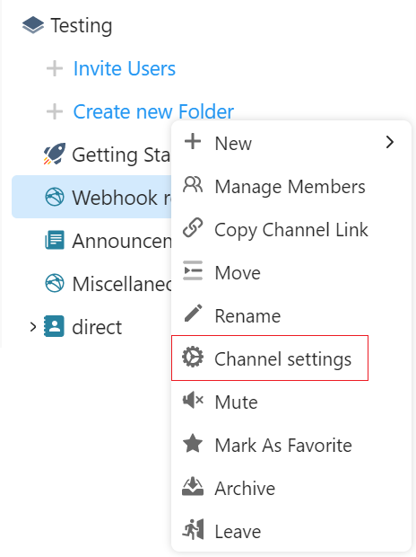

3. Choose “Channel settings” option in the channel context menu
4. Choose “Webhook Bot Settings” in the “Recommended” list

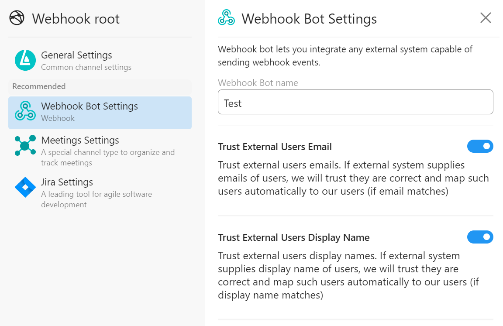

5. Name your bot in the “Webhook bot name field”
6. Choose needed bot settings (will be explained below)
7. Click “Install button”

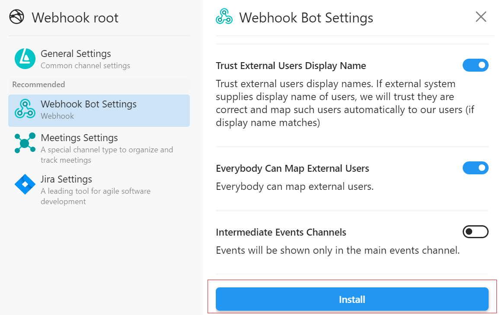

8. Copy and save the Webhook URL that appeared - this is the URL to access Webhook

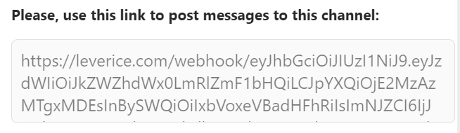

Bot settings
--------

Here’s a short explanation of what settings does Leverice Webhook Bot present and what are the main purposes of them.

1. **Trust external users emails option**

- *If this option is on:* if an external system supplies emails of users, Leverice will trust they are correct and map such users automatically to Leverice users if the email matches.

- *If this option is off:* external users' emails won’t be trusted.

2. **Trust external users display name option**

- *If this option is on:* if an external system supplies users display names, Leverice will name the users automatically if the name matches.

- *If this option is off:* external users' display names won’t be trusted.

3. **Everybody can map external users option**

- *If this option is on:* anyone in the channel can map external users.

- *If this option is off:* only administrators can map external users.

4. **Intermediate events channels option**

- *If this option is on:* events will be duplicated in intermediate events channels.

- *If this option is off:* events will be shown only in the main events channel.

What request template to use on the Webhook URL
############################################

On the generated Webhook URL we can POST requests. POST requests need to have only one header and a payload.

HTTP Header
--------

There is only one HTTP header that’s required to use:

- Content-Type: application/json

Payload
--------

The POST request body has 2 elements:

1. **Text** (simple text info that the event will show)
2. **Matter** (If the matter is added into JSON event that is being sent, Leverice can indicate the exact channel where to post the event after pressing the “Dive” button).

Matter has 2 fields: **“id”** and **“name”** which are the unique id which will store all the events that have the same id and a display name that will be shown to a user.

Example
--------

.. code-block:: json

 {
    "text": "Example text",
    "matter": {
        "id": "Example ID",
        "name": "Just a matter"
    }
 }

How it’ll look in the events channel:

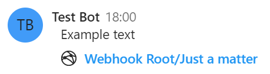

What types of messages can be sent using the Webhook Bot
############################################

Simple text message
--------

Simple text message can be sent as an event. This message won’t create any new channel and can be seen only in the events channel itself.

The payload:

.. code-block:: json

 {
    "text": "Example text"
 }

How it’ll look in the events channel:

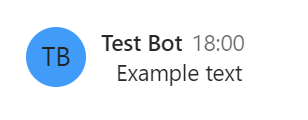

Simple matter message
--------

Simple matter message that will have a button underneath its event that navigates to the target channel created by clicking on it.

The payload:

.. code-block:: json

 {
    "text": "Example text",
    "matter": {
        "id": "Example ID",
        "name": "Just a matter"
    }
 }

How it’ll look in the events channel:

A few matter messages with the same ids
--------

If some matter messages have the same ids, they will all be placed into the same channel.

The payload:

.. code-block:: json

 {
    "text": "Example text 1",
    "matter": {
        "id": "Example",
        "name": "Matter channel"
     }
 }

.. code-block:: json

 {
    "text": "Example text 2",
    "matter": {
        "id": "Example",
        "name": "Matter channel"
    }
 }

.. code-block:: json

 {
    "text": "Example text 3",
    "matter": {
        "id": "Example",
        "name": "Matter channel"
    }
 }

How it’ll look in the events channel:

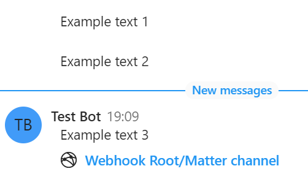

How it’ll look in the channel itself:

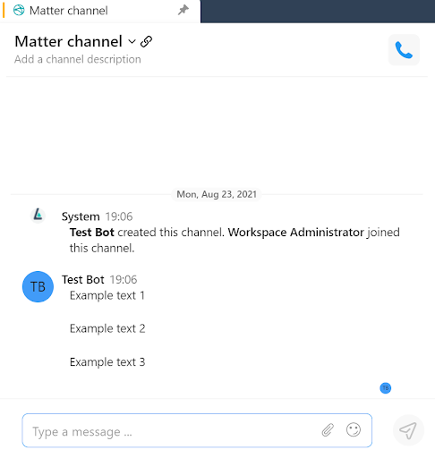

Structured matter
--------

Structured matter allows you to create any hierarchy of events you want by using the “childMatter” parameter.

The payload:

.. code-block:: json

 {
    "text": "Structured matter example",
    "matter": {
        "id": "Parent",
        "name": "Parent matter",
    "childMatter": {
        "id": "Parent/Child",
        "name": "Child matter"
        }
    }
 }

How it’ll look in the events channel:

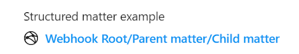

How it’ll look in the channel tree:

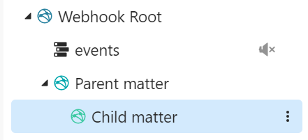

Matter with mention
--------

It is also possible to map external users to existing ones in the Leverice workspace when they were mentioned in the JSON message sent.

To map external users you need to generate the JSON with such parameters as "userId", "dispName" (or "firstName" and "lastName") and "email" using https://leverice.com/api/users.lookup

Some examples:

1. https://leverice.com/api/users.lookup?userId=someId&dispName=Some%20User&email=some@user.com
2. https://leverice.com/api/users.lookup?userId=someId&email=some@user.com&firstName=Some&lastName=User

The payload:

.. code-block:: json

 {
    "text": "Test mention message, }NafCxxk3vX8] {\"userId\":\"user1\", \"dispName\": \"Test User\"}[kwwgYancu3y{",
    "matter": {
        "id": "TestID",
        "name": "Mention",
    }
 }

This way users with unique "userId" and "dispName" parameters will be mentioned in the events channel and can be mapped individually in the "Security realms" channel which will be created automatically after the matter with mention is sent.

How it’ll look in the events channel:

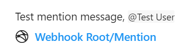

How it’ll look in the newly created “Security realms” channel for mapping users:

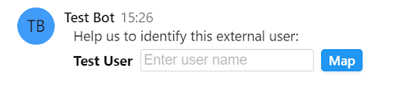

After the channel is created, you’ll see the “Help us to identify this external user” message.

*To map the user follow this steps:*

1. Click on the field
2. Choose the user name from the list appeared

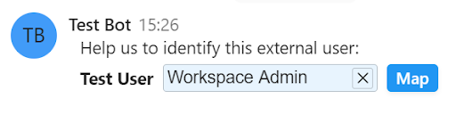

3. Click on “Map button”
4. Confirm action in the pop-up window. Choose “Just map” option if you don’t want this user to be invited to the channels he/she was mentioned or “All channels” if you do.

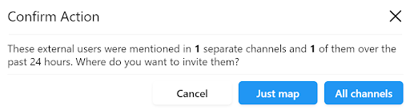

5. After the action is confirmed, the user will be mapped and the message will be changed to “has been mapped...” automatically.

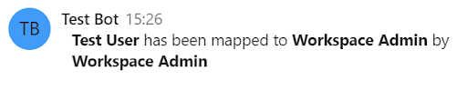

If you want to map users without mentioning them you need to add the “attention” array parameter with “userId” and “dispName” parameters specifically described for individual users. This way users won't be mentioned but they still can be mapped.

The payload:

.. code-block:: json

 {
    "text": "Test mention message,}NafCxxk3vX8]{\"dispName\":\"Some User\",\"email\":\"some@user.com\",\"userId\":\"someId\"}[kwwgYancu3y{",
    "matter": {
        "id": "TestID",
        "name": "Mention",
        "attention": [
          {
            "userId": "test1",
            "dispName": "Test User 1"
          }
        ]
      }
 }

How it’ll look in the events channel:

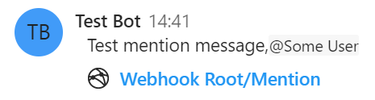

How it’ll look in the "Security realms" channel:

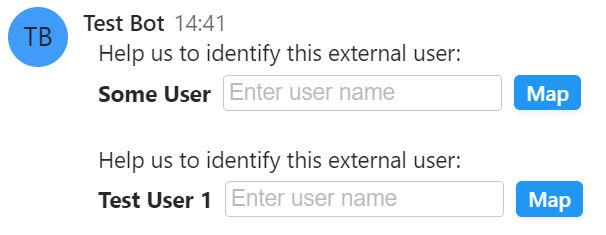